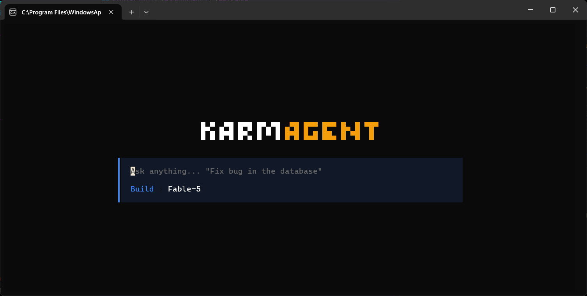

# KarmAgent

[](https://github.com/RaplesWojtyla/KarmAgent/actions/workflows/ci.yml)

An AI-powered coding agent that runs directly in your terminal. Built with [Bun](https://bun.sh) and rendered using [@opentui/react](https://github.com/nicholasgasior/opentui) for a rich, interactive TUI experience.

> **Status:** Work in progress — core UI shell is functional, AI backend integration coming soon.

## Screenshot

<p align="center">
  
</p>

## Features

- **Terminal UI** — Full React-based terminal interface at 60fps, powered by `@opentui/core`
- **Command Menu** — Slash commands (`/new`, `/theme`, `/models`, `/agents`, etc.) with fuzzy filtering
- **30+ Color Themes** — From editor classics (Dracula, Nord, Tokyo Night, Catppuccin) to neon aesthetics (Cyberpunk, Synthwave, Matrix) and light themes. Preferences persist to `~/.karmagent/preferences.json`
- **Dialog System** — Modal dialogs with keyboard layer management and backdrop dismiss
- **Toast Notifications** — Timed, variant-based notifications (success / error / info)
- **Keyboard Layer Stack** — Layered input focus management with `Ctrl+C` responder chain

## Tech Stack

| Layer        | Technology                          |
| ------------ | ----------------------------------- |
| Runtime      | [Bun](https://bun.sh)              |
| Language     | TypeScript (strict mode)            |
| UI Framework | `@opentui/react` + React 19        |
| Monorepo     | Bun Workspaces                      |
| CI           | GitHub Actions (typecheck on push)  |

## Project Structure

```
karmagent/
├── packages/
│   └── cli/                        # Terminal client package (@karmagent/cli)
│       └── src/
│           ├── index.tsx            # App entry point & provider tree
│           ├── components/
│           │   ├── header.tsx       # ASCII art header
│           │   ├── input-bar.tsx    # Main text input with command integration
│           │   ├── status-bar.tsx   # Bottom status indicators
│           │   ├── border.tsx       # Reusable border presets
│           │   ├── dialog-search-list.tsx
│           │   ├── command-menu/    # Slash command palette
│           │   └── dialogs/        # Dialog content (theme picker, etc.)
│           └── providers/
│               ├── theme/          # Theme context, 30+ theme definitions
│               ├── keyboard-layer/ # Layered keyboard focus management
│               ├── dialog/         # Modal dialog state
│               └── toast/          # Toast notification system
├── package.json                    # Root workspace config
├── tsconfig.base.json              # Shared TypeScript config
└── .github/workflows/ci.yml       # CI pipeline
```

## Getting Started

### Prerequisites

- [Bun](https://bun.sh) v1.0+

### Install & Run

```bash
# Clone the repository
git clone https://github.com/RaplesWojtyla/KarmAgent.git
cd KarmAgent

# Install dependencies
bun install

# Start the CLI in watch mode
bun run dev:cli
```

## Available Commands

Type `/` in the input bar to open the command menu:

| Command     | Description                       |
| ----------- | --------------------------------- |
| `/new`      | Start a new conversation          |
| `/agents`   | Switch agents                     |
| `/models`   | Select AI model for generation    |
| `/sessions` | Browse past sessions              |
| `/theme`    | Change color theme                |
| `/login`    | Sign in with your browser         |
| `/logout`   | Sign out of your account          |
| `/upgrade`  | Buy more credits                  |
| `/usage`    | Open billing portal               |
| `/exit`     | Quit the application              |

## Keyboard Shortcuts

| Key          | Action                                              |
| ------------ | --------------------------------------------------- |
| `Enter`      | Submit message / execute selected command            |
| `Ctrl+Enter` | Insert newline                                      |
| `Ctrl+C`     | Clear input → close dialog → exit (responder chain) |
| `Escape`     | Close active dialog                                 |

## License

This project is licensed under the [MIT License](LICENSE).
